<p align="center">
  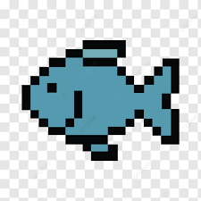
</p>

<h1 align="center">Port Fishing</h1>

<p align="center">
  <strong>Turn your SDLC workflow into a fishing game.</strong><br/>
  A Chrome extension that rewards meaningful engineering activity inside <a href="https://app.getport.io">Port.io</a> with collectible pixel-art fish.
</p>

<p align="center">
  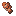
  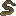
  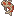
  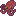
  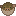
  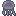
  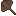
  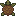
  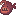
  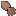
  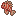
  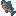
  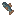
  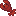
</p>

---

## The Idea

Engineers do great work inside Port.io every day - merging PRs, resolving incidents, improving scorecards, shipping services. **Port Fishing** turns that progress into a lightweight game loop:

1. Complete meaningful SDLC actions in Port.io
2. Earn **Fishing Tokens** (baits)
3. Spend bait to **go fish**
4. Collect pixel-art fish in your personal **aquarium**
5. Fill out your **Fish-Dex** - gotta catch 'em all

It's not a replacement for Port.io workflows - it's a motivational layer on top of them.

## Game Loop

<table>
<tr>
<td width="80" align="center"><br/><sub>Earn Bait</sub></td>
<td width="80" align="center">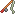<br/><sub>Go Fish</sub></td>
<td width="80" align="center">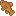<br/><sub>Catch Fish</sub></td>
<td width="80" align="center">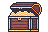<br/><sub>Collect</sub></td>
</tr>
</table>

**Bait sources** - merged PRs, resolved incidents, completed scorecards, service lifecycle events, ownership updates, and other Port.io-backed outcomes. No rewards for page refreshes or empty clicks.

**Rarity** is earned, not random. Faster PR merges, changes to untouched files, and work across different service areas all nudge your odds toward rarer catches.

## Fish Pools

Fish are grouped into pools that map to service areas in the Port monorepo. To complete the Fish-Dex, you'll need to work across different parts of the system.

| Pool | Habitat | Services | Example Fish |
|------|---------|----------|-------------|
| **Product Surface** | Shallow Reefs | `frontend`, `page-service` | Clownfish, Koi, Lionfish |
| **Core Platform** | Deep Ocean | `port-api`, `asset-service`, `search-service` | Tuna, Anglerfish, Blobfish |
| **Workflow & Automation** | River Delta | `workflow-service`, `action-service`, `scheduler-service` | Guppy, Piranha, Red Snapper |
| **Integrations & Data** | Open Sea | `integ-service`, `github-app`, `slack-app`, `lakehouse-*` | Barracuda, Octopus, Sea Turtle |

## Rarity Tiers

<table>
<tr>
<td align="center">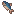<br/><strong>Common</strong></td>
<td align="center"><br/><strong>Uncommon</strong></td>
<td align="center"><br/><strong>Rare</strong></td>
<td align="center"><br/><strong>Legendary</strong></td>
</tr>
</table>

Rarity modifiers: PR lifecycle speed, file freshness, service pool coverage, and change value. No single factor guarantees a rare fish - they're nudges, not switches.

## Aquarium & Decorations

Your aquarium is a living display of everything you've caught. Fish swim around with pixel-art physics, and you can decorate with items from your collection.

<p align="center">
  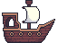
  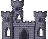
  
  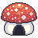
</p>

Features an **editor mode** with a sidebar for placing and managing decorations - toggle visibility, adjust depth, and arrange your underwater world.

## Product Surfaces

- **Chrome Extension** - the main surface. Runs on top of Port.io, reads your activity, shows your baits, lets you fish, and opens the aquarium. Feels native, fast, and non-disruptive.
- **Aquarium** - personal collection view with swimming fish and decorations.
- **Fish-Dex** - catalog of all discovered and undiscovered fish. Tracks completion progress.
- **Side Panel** - shop for rods and bait, manage inventory, bulk buy and sell.

## Tech Stack

- **Chrome Extension** (Manifest V3) with side panel, popup, and content script
- **React 19** + **Vite 8** for the extension UI
- **Vanilla JS** fishing engine and fish registry
- **Port.io API** integration for SDLC activity tracking
- Pixel-art assets - 93 unique fish, 30+ decorations, multiple rods and baits

## Getting Started

```bash
cd extension
npm install
npm run build
```

Then load the `extension/dist` folder as an unpacked extension in `chrome://extensions` (enable Developer mode).

For development with hot reload:

```bash
npm run dev
```

## Collection Preview

<p align="center">
  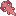
  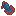
  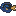
  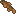
  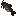
  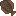
  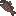
  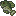
  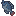
  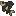
  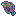
  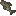
  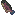
  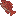
  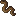
  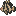
  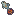
  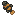
  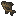
  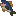
</p>

---

<p align="center">
  Built at the Port.io Hackathon
  <br/>
  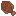
</p>
